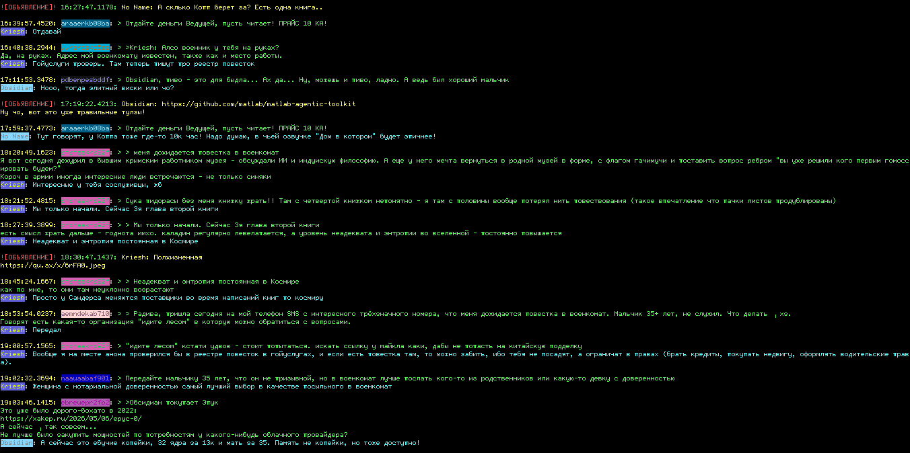
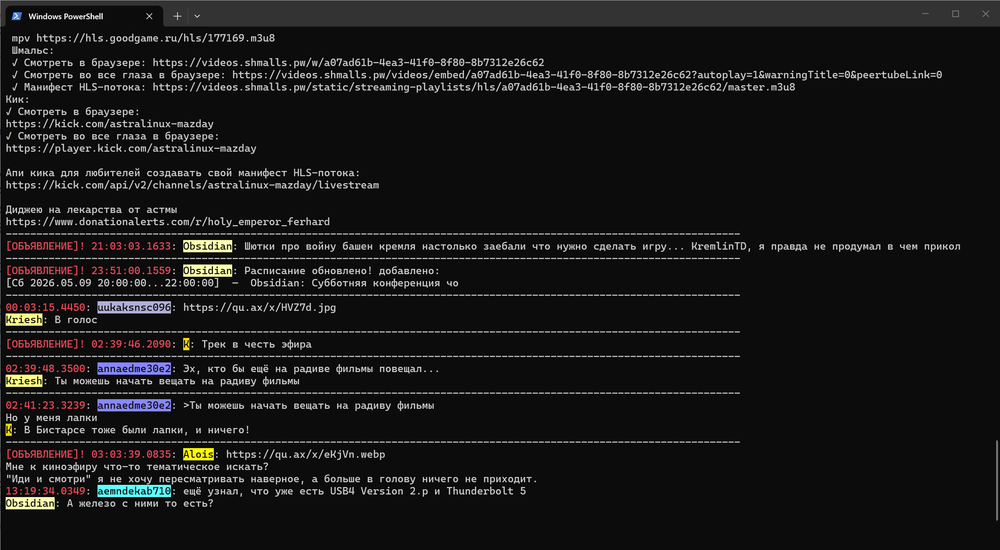
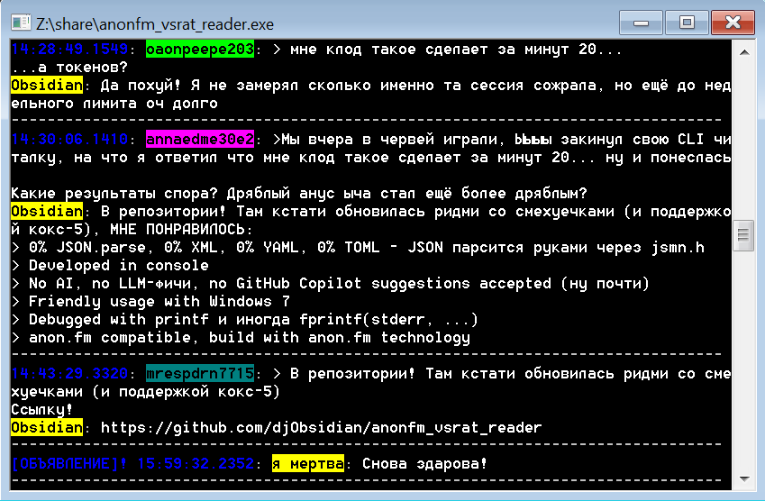

# anonfm_vsrat_reader

Всратый CLI-ридер кукареканий со стороны диджейки на [anon.fm](https://anon.fm).
Чистый ANSI C (C89), libcurl + wolfSSL, статически слинкованный, собирается
под WSL2, кроссом в `.exe` под винду, и под Android (Termux / adb shell)
из той же папки.

Делает то же самое что [`kekejucica.py`](https://anon.fm/console/) с офсайта,
но:
- на сишке восемьдесят-девятого года (мы пользуемся СТАНДАРТИЗИРОВАННЫМ языком, как элита)
- с цветами стабильными per-nick (один и тот же ник → один цвет всегда)
- с конфигом цветов
- с watch-режимом и фильтром по диджею
- с поддержкой SOCKS5 (на случай если за роскомнадзором)
- одним самодостаточным бинарём (CA Mozilla вшит, рядом ничего не нужно)

Референс от ЫЫЫЫ (то к чему стремились):



И что получилось у нас в PowerShell:



И в той же программе под Windows 7 (cmd.exe, mingw32-сборка `windows-i686-win7`)
— кириллица, цвета и бейджи целиком работают:



## Использование

```
anonfm_vsrat_reader [options]
  -w, --watch              poll-режим (default)
  -o, --once               распечатать последнюю пачку и выйти
  -i, --interval SECONDS   интервал поллинга (default 5)
  -n, --limit N            показать только N последних
  -d, --dj NAME            фильтр по нику диджея (substring, ci)
  -c, --colors PATH        путь до конфига цветов
      --no-color           без ANSI
      --socks5 HOST:PORT   ходить через SOCKS5 (DNS тоже через прокси)
      --from-file PATH     читать JSON из файла (для отладки)
      --from-url URL       свой URL (можно несколько раз → зеркала, первый
                           живой 2xx выигрывает)
  -h, --help               help
```

По дефолту запускается в poll-режиме с интервалом 5 секунд — чтобы
даблклик по `.exe` под виндой сразу давал живую ленту, как у людей.
`-o`/`--once` для одноразового вывода (например в пайп).

Без `--socks5` libcurl всё равно подхватывает `ALL_PROXY` /
`https_proxy` / `http_proxy` из окружения, так что `socks5h://...` через
переменную тоже работает. Привет тору.

Примеры:

```bash
# вотч-режим (по дефолту), раз в 5 секунд:
./anonfm_vsrat_reader

# только Кriesh, последние 10, один раз:
./anonfm_vsrat_reader -o -n 10 -d Kriesh

# одноразовый дамп для пайпа:
./anonfm_vsrat_reader -o --no-color | less

# через локальный Tor SOCKS:
./anonfm_vsrat_reader --socks5 127.0.0.1:9050

# через зеркало (или несколько зеркал — первый ответивший 2xx побеждает):
./anonfm_vsrat_reader --from-url https://mirror.example/answers.js \
                      --from-url https://anon.fm/answers.js
```

## Цвета

Каждому нику — стабильный цвет (одинаковый при каждом запуске и в watch'е).
Если у вас Obsidian всегда был зелёный — он и останется зелёным, не
сомневайтесь.

Без конфига — детерминированно: `FNV-1a(nick) % palette`. Палитры разделены
и НЕ пересекаются, чтобы DJ никогда визуально не маскировался под слушателя:

- **Слушательская** палитра — широкая, ~40 цветов (циан, голубой, синий,
  фиолетовый, розовый, малиновый, зелёный, оранжевый, жёлтый, пастель).
  Слушателей десятки, и мы хотим, чтоб каждый узнавался.
- **Диджейская** палитра — наоборот, тесная, всего три цвета
  (жёлтый/зелёный/оранжевый), потому что у нас полтора диджея и они и так
  узнаваемы по тому, кто сегодня на эфире. Меньше цветов — стабильнее
  ассоциация «жёлтый = Kriesh, зелёный = Obsidian».

Помимо ника, **тело сообщения** тоже красится по дефолту — ключи
`listener_text` и `dj_text` в конфиге, оба `15` (яркий белый) по
умолчанию. Мы же **VSRAT** ридер: вырать = читать вслух, и читать
вслух хочется именно тело. Цвет тела — ОДИН консистентный, не равный
цвету ника говорящего: бейдж говорит «кто», тело — «что», смешивать
их незачем. Раньше дефолт был 252 (мягкий серый), но на Win7 cmd с
WinAPI-фолбэком он иногда сливался с фоном — 15 — это прямой CGA-15
WHITE без неоднозначностей в downconvert'е. Если хочется варианта
«у каждого ника свой цвет тела» — поставь в конфиге `*_text * hash`.
Если хочется монохром — `off`.

С конфигом — явная мапа nick → 256-color индекс. Файл ищется в:
1. путь, переданный в `-c PATH`
2. `./anonfm_colors.conf`
3. `$XDG_CONFIG_HOME/anonfm/colors.conf`
4. `~/.config/anonfm/colors.conf`
5. `%APPDATA%\anonfm\colors.conf` (винда)

Формат — см. [`anonfm_colors.conf.sample`](anonfm_colors.conf.sample):

```
listener        araaerkb08ba    96
listener        *               hash    # дефолт для бейджей слушателей
dj              Kriesh          226
dj              Obsidian        118
dj              *               hash    # дефолт для бейджей диджеев

dj_text         *               hash    # включить раскраску ответов диджеев
listener_text   *               off     # тело сообщений слушателей не красить
```

Значения цвета:
- число от 0 до 255 — конкретный xterm-256 цвет
- `hash` — детерминированно из встроенной палитры по нику
- `off` — не красить (дефолт для `*_text`)

## Допил и сборка
Читай в .\DEV.md

## Наши достижения

* No webtechnology used, NO CSS USED
* No webtechnology were harmed
* No browser required, no Electron, no V8, no node_modules на 400 МБ
* No Firefox required
* No Chrome required, no Chromium, no Edge, no Opera GX with RGB
* 0% JSON.parse, 0% XML, 0% YAML, 0% TOML — JSON парсится руками через `jsmn.h`
* Developed in chat
* VIM compatible (а как иначе)
* NO PHP USED
* NO C++ USED, no STL, no `std::shared_ptr`, no templates на 40 экранов
* NO C# USED, no .NET, no Mono
* NO RUST USED, no `unsafe { }`, no борроу-чекера, no twitter-thread про safety
* NO GO USED, no `if err != nil`, no goroutine leaks
* NO PYTHON USED, no `pip install`, no virtualenv, no PEP 8 holy wars
* No JavaScript, no TypeScript, no WebAssembly, no React, no Vue, no Svelte
* No async/await — мы блокирующие, как пенсионер на почте
* No 5G required (хватит и dial-up через PPP)
* No Docker required, no Kubernetes, no Helm chart, no service mesh
* No telemetry, no analytics, no Sentry, no DataDog, no "anonymized usage stats"
* No AI, no LLM-фичи, no GitHub Copilot suggestions accepted (ну почти)
* No Windows 10/11 required
* Friendly usage with Windows 7
* Friendly usage with Android via Termux / adb shell (bionic-нативно через NDK
  или просто кидаем aarch64-musl бинарь — он же Linux, ему пофиг)
* No Google Play Services required, no AndroidX, no Gradle, no `R.java`
* Debugged with `printf` и иногда `fprintf(stderr, ...)`
* anon.fm compatible, build with anon.fm technology
* Mozilla CA вшит прямо в `.text` секцию, как завещали отцы
* Один файл на 2.6 МБ статически — таскай как хочешь
* C89, как у дедушки

## Todo

* Полноценный APK для андроида без Java/Kotlin/Gradle — pure C
  NativeActivity в стиле rawdrawandroid, иконка на рабочем столе,
  фоновый сервис с push-уведомлением на новый кукарек (Phase 2 — пока
  есть только Phase 1, бинарь под Termux / adb shell)
* Поддержка Fidonet — пусть кукареки заодно расходятся по эхам
* Поддержка USENET / NNTP — `nntp://news.anon.fm/alt.anon.fm.kukareki`,
  читать через `tin`/`slrn`/`Pan`, как в 1998-м
* Шлюз в **телетекст** — раскидать по страницам 700–799, чтоб бабушка
  на даче через рамблер-телек тоже была в курсе кто такой Obsidian
* Шлюз в **Meshtastic** — реле кукареков по LoRa-меш сети, для тех кто в
  бункере / в лесу / в отъезде по геополитическим причинам. На прямой
  узел через UART, либо в публичный канал; payload урезать до 230 байт,
  emoji дропать, диджей-ник — двумя символами
* Поддержка ICQ (OSCAR) — слать новые кукареки в ICQ-аське через UIN
* Поддержка пейджера через RDS на FM-частоте
* Порт на DOS, чтоб запускать в DOSBox
* Порт на ZX Spectrum (через сетевой адаптер ZXNet)
* Озвучка кукареков SAPI5-голосом «Николай», как в Промт 98
* Поддержка отправки сообщения с рендерингом капчи через ASCII арт

## FAQ

**Q: А почему ANSI C, а не нормальный C23?**
A: Потому что мы элита и пользуемся **СТАНДАРТИЗИРОВАННЫМ** языком. C89 ратифицирован
ANSI X3.159-1989 и ISO/IEC 9899:1990. Что ратифицировал ваш `auto&&` и `consteval`?
Шансов собрать C89 кодом на любой железке — от ПДП до микроволновки — больше, чем
у любой более молодой ревизии. Стандарты не для модников, стандарты для тех,
кто хочет чтобы оно работало через 30 лет.

**Q: А почему `vsrat`?**
A: Потому что reader всратый, а не «elegant», «modern», «production-ready».
Никаких инверсий зависимостей, никаких фабрик абстрактных билдеров — мы
просто по таймеру дёргаем `answers.js` и пишем в stdout.

**Q: А почему watch по дефолту?**
A: Чтоб в винде даблкликнул по `.exe` — и сразу льётся лента, без
бубнов и батников.

**Q: А почему wolfSSL, а не OpenSSL?**
A: Потому что OpenSSL не собирается статически на 12 платформах сразу
без слёз, а wolfSSL — собирается. И весит меньше. И лицензия GPLv2
(или коммерческая, если вам в продакшен), но мы для себя — нам пофиг.

**Q: Будет ли запись истории / SQLite / экспорт в Markdown?**
A: Нет.

**Q: Будет ли GUI?**
A: Нет. Если очень надо — ваш терминал уже GUI.

**Q: А под BSD соберётся?**
A: Должно. Не пробовал. Если что — кидай PR.

**Q: А под Android?**
A: Да, два варианта — `android-aarch64` через NDK (правильный bionic-бинарь,
~1.2 МБ) или просто `linux-aarch64` из релиза (musl-static, ~2.5 МБ — тоже
запустится в Termux'е, потому что Android это Linux в фуфайке). Подробности
— в [DEV.md](DEV.md), секция «Кросс на Android». Полноценного APK с иконкой
пока нет — это Phase 2, когда руки дойдут.

## Лицензия

Делай шо хошь. Фолбэки и зависимости (wolfSSL, libcurl, jsmn, Mozilla
cacert) — под собственными лицензиями, разбирайся сам.

Лично мой код — public domain / WTFPL / делайте что хотите. Если ваш
корпоративный legal отдел такое не принимает — считайте, что MIT.
Если и MIT не принимает — у меня для вас плохие новости про вашу работу.
